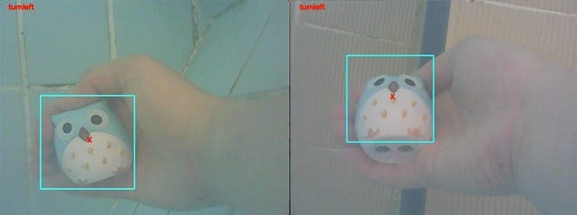

# Real Time Computer Vision and Machine Learning Object Tracking on Raspberry Pi
This is my final year university project that utilizes OpenCV (an open source computer vision library) to train a machine learning model to track objects in real-time using Raspberry Pi

In this project, I explored different algorithms for object detection. Before trying Haar Classifier, I have tried are frame differencing, background subtraction, shape and color detection. However, the results are not satisfactory because the background is not static (which produces noise) and the object has multiple features (a face and a body).

Even after using Haar classifier, the model still results in false positives. The solution is to **use two Haar classifier models.** The idea is the owl face is always inside the body. So if the model detects an owl body but does not detect an owl face within the coordinates of the owl body, then it is a false positive and vice versa.
Steps:
1. Generate training images: generate multiple positive and negative images using opencv_createsamples and images from image-net.org. Generate two sets of positive images: one for the owl face, and one for the owl body
2. Train model: using opencv_traincascade command, train for both owl face and owl body detection. The result is an xml file for each model. When generating images and training model, it is not recommended to do so in the Raspberry Pi. Instead, do steps 1 and 2 in a separate machine with higher specs (e.g. your own laptop or PC) and then extract the xml files to Raspberry Pi.
3. Detect object: in the Raspberry Pi Python program, initialize both models and start the video capture. Convert the video to grayscale and detect owl body in the video. If an owl body is detected, create a **region of interest (ROI)** and search for an owl face inside this area. Then put a bounding rectangle around the owl body.

